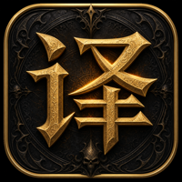
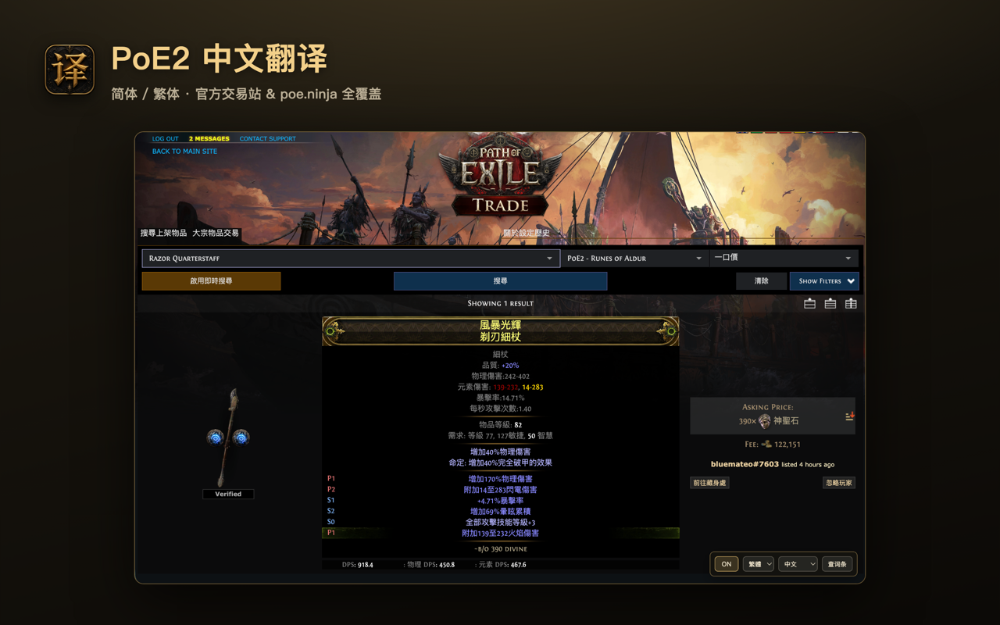
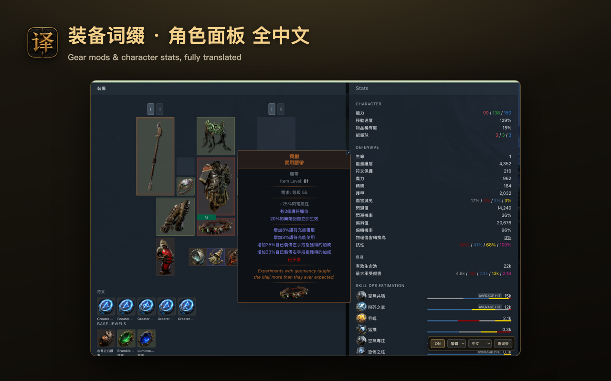
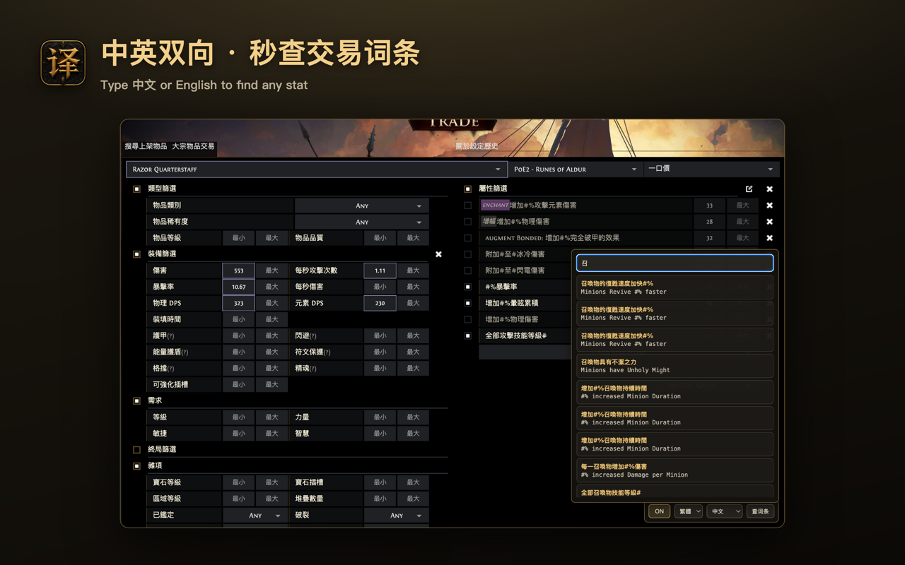
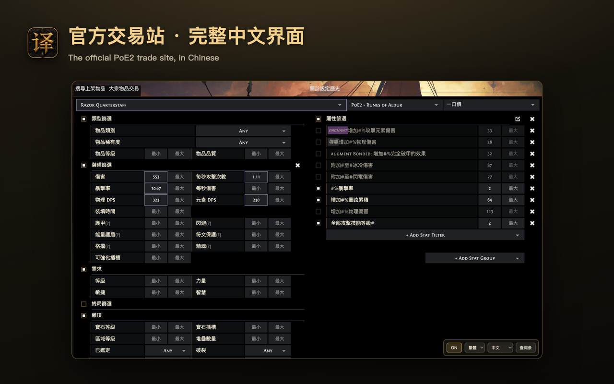

<p align="center">
  
</p>

<h1 align="center">PoE2 中文翻译 · PoE2 Chinese Translation</h1>

<p align="center">
  A Chrome extension that adds <b>Simplified / Traditional Chinese</b> to
  <i>Path of Exile 2</i> community sites and the official trade site.<br/>
  Every term comes <b>1:1 from official game data</b> — never machine-guessed.
</p>

<p align="center">
  <a href="https://chromewebstore.google.com/detail/gmhpicnoomfogofehjpaocadnkdphgck">
    
  </a>
  <a href="https://chromewebstore.google.com/detail/gmhpicnoomfogofehjpaocadnkdphgck">
    
  </a>
  
</p>

<p align="center">
  <b><a href="https://chromewebstore.google.com/detail/gmhpicnoomfogofehjpaocadnkdphgck">→ Install from the Chrome Web Store</a></b>
</p>

> 不隶属于 Grinding Gear Games，也未获其认可。Path of Exile 为 GGG 商标。
> Fan-made; not affiliated with or endorsed by Grinding Gear Games.

## Screenshots

| | |
|---|---|
|  |  |
|  |  |

## Features

- **简体 / 繁体** Chinese, switchable any time
- Three display modes: **英文+中文** (bilingual) · **仅中文** (replace) · **悬浮提示** (tooltip)
- Covered sites: **poe.ninja / poe2.ninja**, **pobb.in**, **Maxroll** (`/poe2`),
  **FilterBlade**, **Mobalytics** (`/poe-2`), and the **official trade site**
  (`pathofexile.com/trade2`, where GGG ships no Traditional Chinese)
- Built-in **查词条**: type English / 简体 / 繁体 and find the matching term in all three;
  copy the official English to paste into the trade stat search
- Fully local & offline (the dictionary is bundled); collects no user data

## Install

**From the Chrome Web Store (recommended):**
[chromewebstore.google.com/detail/…/gmhpicnoomfogofehjpaocadnkdphgck](https://chromewebstore.google.com/detail/gmhpicnoomfogofehjpaocadnkdphgck)

**From source (unpacked):**

```bash
cd extension
npm install
npm run build       # builds the dictionary + the extension into dist/
```

Then in Chrome → `chrome://extensions` → enable **Developer mode** → **Load unpacked**
→ select `extension/dist`.

## How the dictionary is built

The built dictionaries are committed (`extension/data/dictionary.*.json`), so you can
`npm run build` without any crawling. `build-dictionary.mjs` overlays these sources:

```
extension/data/*.json   ──build-dictionary.mjs──►  dictionary.zh-CN.json / zh-TW.json
   ├ source-terms.json        (term names + mods, from PoE2DB)
   ├ client-keywords.json     (official client — client-extract/build-keyword-overlay.mjs)
   ├ rare-name-parts.json     (official client — client-extract/build-rare-names.mjs)
   ├ league-terms.json        (PoE2DB /cn + /tw league pages)
   ├ manual-overrides.json    (site UI labels with no 1:1 game source)
   └ site-ui.json             (trade-site UI chrome)
```

- `extension/scripts/` — `build-dictionary.mjs` (overlay → dictionaries) and
  `build-trade-content.mjs` (a CSP-proof self-contained bundle for strict-CSP sites
  like the official trade site + Mobalytics).
- `client-extract/` — pulls official Traditional Chinese straight from the PoE2 patch
  CDN via [`pathofexile-dat`](https://github.com/SnosMe/poe-dat-viewer) (no game install
  needed). The downloaded tables are **not** redistributed (see `.gitignore`).

> The PoE2DB scraping step that produces `source-terms.json` is run upstream and is not
> included here, to be respectful of [PoE2DB](https://poe2db.tw)'s servers. The compiled
> output is what ships.

## Data sources & licensing

- **Code**: MIT (see [LICENSE](LICENSE)).
- **Translation data**: derived from official PoE2 game data and **PoE2DB (poedb.tw)**.
  It is game content owned by Grinding Gear Games, redistributed here for
  **non-commercial fan use** only. Credit to [PoE2DB](https://poe2db.tw).

## Credits

Built on the shoulders of the Path of Exile community — thank you:

- **[PoE2DB](https://poe2db.tw)** (chuanhsing) — the primary source of 1:1 Chinese
  term data (items, mods, leagues). Please support and be respectful of their site.
- **[pathofexile-dat / poe-dat-viewer](https://github.com/SnosMe/poe-dat-viewer)**
  (SnosMe) — extracts official Traditional Chinese straight from the game client.
- **[RePoE](https://github.com/repoe-fork/repoe-fork.github.io)** — English stat / mod
  data reference.
- **[Scrapling](https://github.com/D4Vinci/Scrapling)** (D4Vinci) — used upstream to
  gather term data.
- **[Awakened PoE Trade](https://github.com/SnosMe/awakened-poe-trade)** &
  **[Exiled Exchange 2](https://github.com/Kvan7/Exiled-Exchange-2)** — reference for
  trade stat-id handling.
- **[CRXJS Vite Plugin](https://github.com/crxjs/chrome-extension-tools)** +
  **[Vite](https://vitejs.dev)** — extension build tooling.
- The sites this extension enhances: **poe.ninja**, **pobb.in**, **Maxroll**,
  **FilterBlade**, **Mobalytics**, and GGG's official trade site.

Path of Exile 2 © **Grinding Gear Games**. This is an unofficial, non-commercial fan
project, not affiliated with or endorsed by GGG.

## Privacy

No data collection, no tracking, no external servers — translation runs entirely in
your browser. Full policy: <https://lmcmz.github.io/poe2-cn-translation/>
